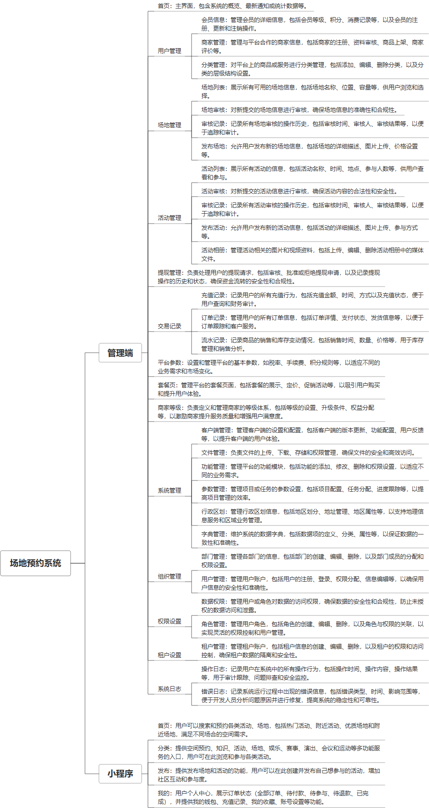

 

    
 

公司拥有上百套具有自主知识产权的软件系统，详情请查看码云首页或公司官网

 
<h1>场地预约管理系统</h1>

<a href="https://www.haishi.net.cn/">公司官网</a> ｜ <a href="https://www.haishi.net.cn/">在线体验</a>

 

## 系统介绍

支持场地在线发布、预约、管理等服务。
本项目名称为场地预约系统，是一款方便用户进行场地预约的系统。该系统主要包括用户管理、分类管理、活动管理、场地管理、提现管理、交易记录、平台参数、套餐页、商家等级、组织管理、租户管理等模块。本系统从用户层面可以分为两个端：管理端和用户小程序端。
- 管理端：公司内部管理员用户使用，可以进行用户管理、分类管理、活动管理、场地管理、提现管理、交易记录、平台参数、套餐页、商家等级、组织管理、租户管理等
- 用户小程序端：用户使用，可以进行场地预约、查看活动、管理订单、进行充值提现等操作
                

## 系统功能介绍

### 系统包含终端说明

管理端（WEB）、用户端（微信小程序）

| 序号 | 模块 | 模块说明 |
| --- | --- | --- |
| 1 | FWY-VENUE-TYGYY-SERVER | 服务端 |
| 2 | FWY-VENUE-TYGYY-MANAGE | 管理端 |
| 3 | FWY-VENUE-TYGYY-MP | 小程序 |

### 系统功能结构

### 系统功能说明

- 用户管理：对用户进行管理，包括会员信息管理和商家管理
- 分类管理：对场地和活动进行分类管理
- 活动管理：对活动进行发布、审核、管理等操作
- 场地管理：对场地进行发布、审核、管理等操作
- 订单管理：用户可以查看自己的订单信息，并可以进行取消订单、支付订单等操作
- 充值提现：用户可以进行账户充值和提现操作

## 系统主要界面

## 系统技术说明

### 代码模块说明

| 序号 | 目录 | 目录说明 |
| --- | --- | --- |
| 1 | FWY-VENUE-TYGYY-SERVER/power | -- |
| 2 | FWY-VENUE-TYGYY-SERVER/reserve | -- |

### 系统技术选型

#### 开发语言/框架

JAVA（JDK1.8）
系统结构：微服务架构
框架：SpringBoot2.x
前端框架：VUE2

#### 服务中间件

Nginx
Tomcat

#### 数据库

MySQL（5.7+）
Redis

#### 其他说明

无

## 系统演示/商用

请扫码添加客服微信获取演示地址和系统详细资料。

如果您想基于场地预约管理系统进行商业化交付或定制开发服务，我们提供有偿的技术服务支持，合作模式不限，欢迎沟通！

公司官网地址： <a href="https://www.haishi.net.cn/">https://www.haishi.net.cn</a>

联系客服获取专业回答。

## 使用须知

1、 本项目商用必须获得版权所有者的授权。

2、 未经允许本项目代码不允许二次出售。

